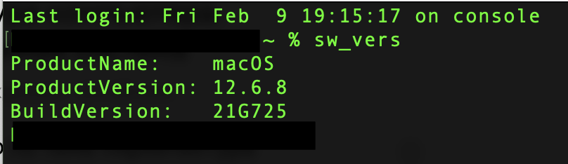
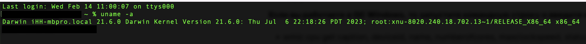
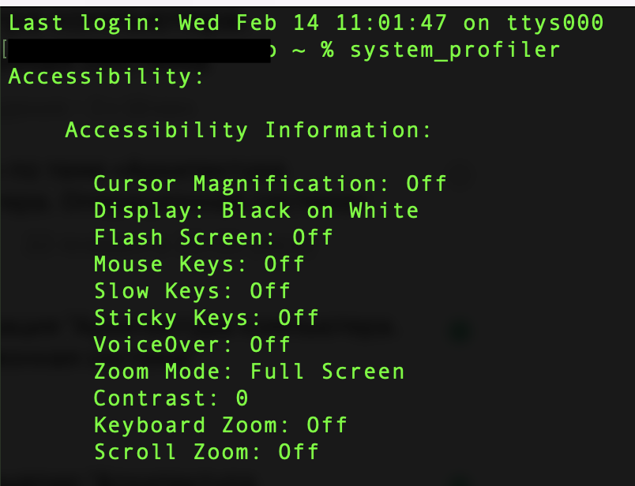
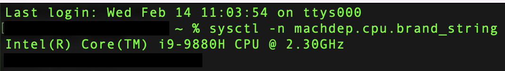
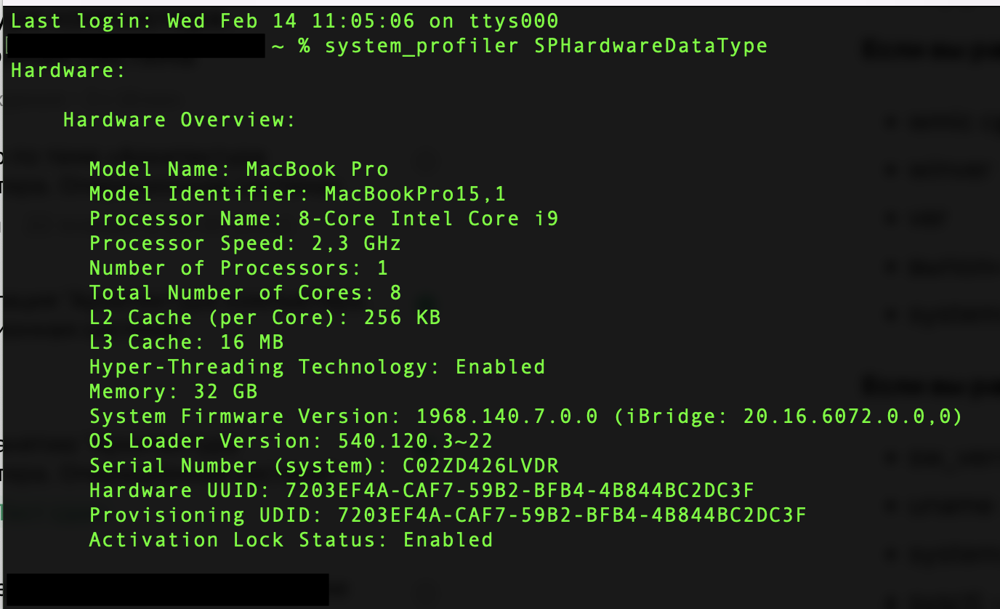

# Домашнее задание

## 1.1 - "Архитектура компьютера. Операционная система" - Штенгелов Игорь

### sw_vers
Выводит информацию о версии macOS

### uname -a
Выводит информацию о названии ОС с подробными атрибутами: имя, где установлена, название и версия ядра и др.

### system_profiler
Выводит подробную информацию о конфигурации оборудования и ПО

### sysctl -n machdep.cpu.brand_string
Выводит информацию о переменной окружения, в которой указана информация о процессоре

### system_profiler SPHardwareDataType
Выводит сводку об установленном оборудовании

